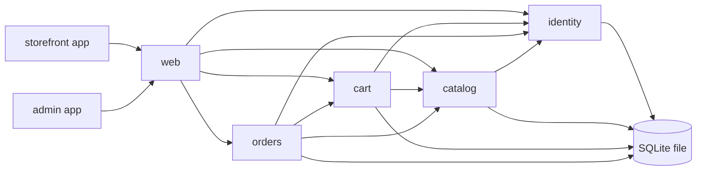
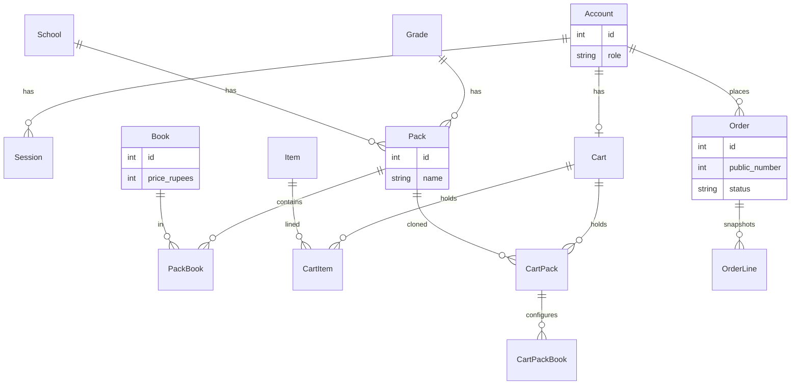
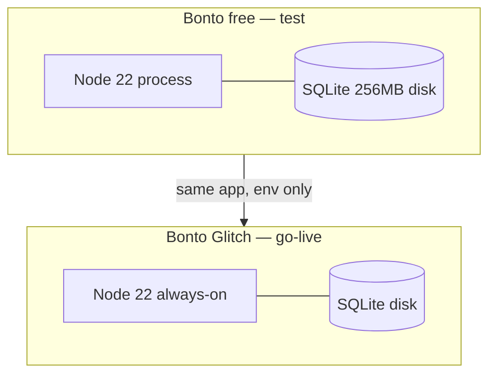

# Architecture Spine — Book List

## Design Paradigm

**Modular monolith.** One Node process. Four domain modules own tables and writes. Two React apps (parent storefront, Gothami’s admin) are clients of one JSON API. `web` wires HTTP, the Vite build, and the one SQLite connection; it owns no domain rows. Identity owns the session cookie.



## Invariants & Rules

### AD-1 — Modular monolith [ADOPTED]

- **Binds:** all
- **Prevents:** a second service; modules cut by UI so parent and admin each own “order”; domain writes from React or raw SQL in `web`
- **Rule:** one deployable. Domain behaviour lives in `identity`, `catalog`, `cart`, `orders`. Storefront and admin are doors, not owners.

### AD-2 — Portable process and host [ADOPTED]

- **Binds:** deploy, SQLite path, env, PRD §9
- **Prevents:** baking Bonto sleep or hour caps into app identity; a rewrite at go-live; a host with an ephemeral disk as production; silent Node 20 (Bonto default)
- **Rule:** the unit of deploy is one Node process plus one durable SQLite file. Build and test on **Bonto free**. Go-live moves the same app to **Bonto Glitch** (always-on, one custom domain). **This overrides PRD §9 treating free-tier hours/sleep as v1 production.** Free-tier sleep and the hour cap are pre-production only. Config and secrets change by environment; code does not. Cold-start skeleton stays (free-tier testing still sleeps; Glitch always-on makes it a no-op). On Bonto, set the runtime to **Node 22 explicitly** (dashboard defaults to 20). `engines.node` is `>=22.12.0` (Vite 8’s floor). Env names: `PORT`, `DATABASE_PATH`, `SESSION_SECRET`, `ADMIN_EMAIL`, `ADMIN_PASSWORD`.

### AD-3 — Module cut and build order [ADOPTED]

- **Binds:** source tree, imports, implementation sequence
- **Prevents:** later folders reading earlier folders’ tables; building all screens with no owner; reverse dependencies
- **Rule:** folders and write ownership:

  | Module | Writes |
  | --- | --- |
  | identity | parent profile (name, one delivery address, WhatsApp, optional second phone, email, password hash), the one admin, sessions, recovery-code hash, admin-set parent password (FR10) |
  | catalog | schools, grades, book master, packs, items. Hard-delete refused while referenced by a live pack |
  | cart | the authenticated parent’s saved lines (configured pack clones and merged items) |
  | orders | placed orders; snapshots; `public_number`; status; `delivery_price_rupees` + `payable_total_rupees`; `parent_delivery_note` (set at Place only); `cancellation_reason`; `admin_note`; call-attempted; export zip via catalog reads |
  | web | HTTP mounts, Vite static, one SQLite connection opened at boot, migrations run at boot — no domain tables |

  Allowed depends-on: `web → orders → cart → catalog`, and `identity` used by all. Arrows never reverse. A module is called only through its TypeScript functions. **Build order is identity → catalog → cart → orders.** Each folder ships tryable, with the React screens for that slice, before the next folder starts.

### AD-4 — Shared data and snapshots [ADOPTED]

- **Binds:** catalog, cart, orders, FR16–FR18, FR31–FR34, FR39, FR47–FR53, FR49, §7
- **Prevents:** stored pack prices; live `pack_id` as the cart line; silent reprice; two cart semantics; live catalog leaking into a placed order
- **Rule:** book master is shared; packs reference books; pack displayed price is computed at read time and never stored. A cart **pack** line is a cloned configuration: pack identity + per-book included flag and quantity (1–20), captured at add — not a live pack pointer. Last remaining ticked title cannot be removed (FR31–FR32), enforced in cart and catalog reads, not only in React. Item lines merge by item id + quantity. Cart stores add-time titles and unit prices. GET may annotate live catalog (archived / removed / repriced) and must not silently rewrite stored figures. Place Order refuses unresolved stale flags (FR49), copies the acknowledged configuration plus identity’s address and contacts, and never reads catalog or profile again. Place payload cannot substitute a delivery address. Archive/price edits affect storefront and cart annotations only.

### AD-5 — Session cookie [ADOPTED]

- **Binds:** identity, all authenticated routes, NFR8–NFR9
- **Prevents:** JWT or tokens in JavaScript storage; in-memory sessions wiped by sleep/restart; a second login scheme per UI; `web` inventing cookie semantics
- **Rule:** `identity` is the only module that creates, reads, and destroys sessions and the only Set-Cookie / Clear-Cookie source. One cookie `booklist.sid` for both apps; Path=`/`; Max-Age=14 days; HttpOnly; SameSite=Lax; Secure on HTTPS. Role lives on the account. Session rows live in the same SQLite file. Logout deletes the row. Browse catalog may be anonymous; cart, checkout, orders, and admin require a session. Same-origin + SameSite=Lax is the CSRF control; no second CSRF token.

### AD-6 — React pages, not Next [ADOPTED]

- **Binds:** client, NFR2–NFR3, DESIGN.md, EXPERIENCE.md
- **Prevents:** Next.js; vanilla HTML sprawl; MUI / shadcn / Tailwind; shipping admin JS to parents; DESIGN.md empty-state/cold-start copy beating EXPERIENCE
- **Rule:** two Vite React apps — `client/storefront`, `client/admin` — plus `client/ui` (custom components and CSS variables from DESIGN.md **tokens only**). **This overrides the addendum / EXPERIENCE “static public/ HTML” starter**; still one Express process, not Next. EXPERIENCE.md wins over DESIGN.md on behaviour (empty states, branded cold-start skeleton with no spinner and no wording, admin Orders is one list of all orders with a status filter — not an open-only today list). WCAG 2.2 AA on both apps; honour `prefers-reduced-motion`. Not a PWA; no service worker; a down connection is a wait, not an offline cart. Each app owns its client routes under its mount (AD-12). No named component kit.

### AD-7 — JSON API [ADOPTED]

- **Binds:** both React apps, `web`, NFR4, NFR11
- **Prevents:** tRPC/GraphQL; per-app error shapes; browser calls to SQLite; two Place Order retry dialects
- **Rule:** same-origin JSON under `/api/*` with cookie credentials (`credentials: include`). Success bodies use camelCase. Failures are always an object with `error.code` (stable machine token) and `error.message` (plain English for the UI). Place Order sends header `Idempotency-Key`. All PRD rules are enforced in the owning module, not only in React.

### AD-8 — One SQLite file, SQL in the owner [ADOPTED]

- **Binds:** persistence, NFR10, `web`
- **Prevents:** Prisma/Drizzle; `node:sqlite`; per-request connections; SQL against another module’s tables; modules each opening the file
- **Rule:** one database file on persistent disk. `better-sqlite3`, WAL. `web` opens the single connection at process start, runs numbered migrations, and passes the connection into modules. Each domain module owns its queries as SQL. Migrations are numbered in dependency order (identity, catalog, cart, orders).

### AD-9 — Mutations [ADOPTED]

- **Binds:** cart, orders, FR51–FR52, FR61–FR66, T1–T11
- **Prevents:** half-placed orders; duplicate order numbers; double Place Order; silent stale status writes; skip-confirm; two status dialects; a worker/mailer/queue
- **Rule:** Place Order is one SQLite transaction (snapshot, sequential `public_number`, empty cart) and is idempotent on `Idempotency-Key`. Order numbers are short sequential and allocated so concurrent places cannot collide.

  Stored status strings are exactly: `Order Is Placed`, `Order Confirmed`, `Processing`, `Packing The Order`, `Ready To Deliver`, `On Delivery Partner`, `Delivered`, `Cancelled`. Only the admin advances (T1). No status beyond Order Confirmed without passing through it (T2). Forward 3–6 may skip (T3). Backward among non-terminals **floors at Order Confirmed** — never back to Order Is Placed (T4). Delivered and Cancelled are final (T5). Cancel from any non-terminal requires `cancellation_reason` (T6). Every transition checks expected current status (T7). Parent-cancel vs admin-confirm: first commit wins; loser is told; Cancelled never carries a payable total (T8).

  **Order Confirmed** is one transaction: expected status + required non-negative `delivery_price_rupees` + `payable_total_rupees` = snapshotted goods + delivery. After that, lines, prices, delivery, address, and contacts do not change (T9). No outbound messaging. No second process.

### AD-10 — Export [ADOPTED]

- **Binds:** FR67, NFR10, admin
- **Prevents:** CSV-only (no restore); db-only (unreadable to Gothami); two drifting export buttons; `web` dumping tables
- **Rule:** one Export action downloads one zip: CSV files of orders and catalog (Excel) plus a copy of the SQLite file (restore). `orders` assembles the zip by calling `catalog` and its own reads.

### AD-11 — Secrets and recovery [ADOPTED]

- **Binds:** identity, FR8, FR10, FR74, NFR8
- **Prevents:** secrets in git; extra native password libraries; showing the recovery code in the website; a forgotten admin password requiring redeploy; email/WhatsApp reset
- **Rule:** session secret and first-boot admin credentials are environment variables. Passwords hashed with Node `scrypt`. First boot seeds the admin, generates a single-use recovery code, prints it once to the server log, stores only a hash. Redeeming it sets a new password and prints a new code. Never rendered in either React app. Parent recovery is the admin setting a new password on that parent record (FR10) — no reset email. WhatsApp is contact data, not a login identity. EXPERIENCE parks storefront “forgot password” screens; these server capabilities still ship.

### AD-12 — HTTP mounts [ADOPTED]

- **Binds:** `web`, both React apps
- **Prevents:** `/` vs `/app` vs `/admin` collisions; two API prefixes; admin JS served as the parent home
- **Rule:** Express mounts: `/api` JSON, `/admin` admin Vite app, `/` storefront Vite app. One origin. No CORS. Each React app’s router stays under its mount.

## Consistency Conventions

| Concern | Convention |
| --- | --- |
| Naming | Modules, files, TS exports: kebab/camel as usual. SQL columns `snake_case`. JSON `camelCase`. The module boundary translates. |
| Money | Integer rupees in DB and JSON (`9320`). Pages render `Rs. 9,320`. No decimals, no tax, one currency. |
| Time | UTC text in DB. Screens show Asia/Colombo. |
| IDs | Integer primary keys. Public order number is a separate short sequential integer, spoken as `#1042`. |
| Errors | `error.code` + `error.message` only. No silent refusal (NFR4). |
| Authz | Parent sees only own cart/orders/profile. Admin sees all. Enforced in the module, not the page. |
| Logging | stdout/stderr only (Bonto dashboard). No log service. |
| Config | `PORT`, `DATABASE_PATH`, `SESSION_SECRET`, `ADMIN_EMAIL`, `ADMIN_PASSWORD`. Never committed. |
| Visual | DESIGN.md **tokens** only; `client/ui` maps them to CSS variables. EXPERIENCE.md owns behaviour. English microcopy only. |
| Login | Email + password. WhatsApp is not an identity. No per-order address. No telemetry. |
| Checkout | Goods total only. No delivery estimate. Literal checkout line is UX copy, not an architecture number. |

## Stack

Seed — verified 2026-08-18. Code owns versions once the repo exists.

| Name | Version |
| --- | --- |
| Node.js | 22.12+ (Bonto runtime 22, not default 20; Maintenance LTS vs Active 24) |
| Express | 5.2.1 |
| better-sqlite3 | 13.0.3 |
| TypeScript | 7.0.2 |
| React | 19.2.8 |
| Vite | 8.2.1 |
| tsx (dev) | 4.23.12 |

Dev: `tsx` + Vite (proxy `/api` to Express). Prod: `tsc` + `vite build`; Express serves the built apps.

## Structural Seed

```text
/
  server/
    identity/
    catalog/
    cart/
    orders/
    db/migrations/
    web/
  client/
    storefront/
    admin/
    ui/
  package.json
```

SQLite file lives at `DATABASE_PATH` on Bonto persistent storage, not inside a wiped deploy directory.





## Capability → Architecture Map

| Area | Lives in | Governed by |
| --- | --- | --- |
| Accounts, sessions, admin seed, recovery, parent password reset | identity | AD-3, AD-5, AD-11 |
| Schools, grades, book master, packs, items | catalog | AD-3, AD-4, AD-8 |
| Pack discovery, computed pack price | catalog reads + storefront | AD-4, AD-6 |
| Server-persisted cart, clone vs merge, stale lines | cart | AD-3, AD-4 |
| Place Order, snapshot, sequential id, parent cancel | orders | AD-4, AD-9 |
| Admin Orders (all orders, status filter) | orders + admin | AD-6, AD-9 |
| Parent order history / pipeline view | orders + storefront | AD-5, AD-6, AD-7 |
| Admin export | orders + catalog | AD-10 |
| Chalk & Brass tokens, light/dark, WCAG 2.2 AA | client/ui | AD-6 |
| HTTP mounts, Vite build, DB connection | web | AD-2, AD-8, AD-12 |

## Deferred

- Client router **package** (revisit at first storefront route; AD-12 already fixes the mount).
- Automated test runner (revisit at identity folder).
- Node 24 (revisit if Bonto adds it; today max is 22).
- Off-box replica (Litestream, object storage). Export (AD-10) is v1 durability.
- Live push of order status (WebSocket). v1 has no outbound messaging; parent visibility may poll.
- Rate limiting.
- Payment gateway, custom domain beyond Glitch’s one, Sinhala/Tamil, academic-year versioning, admin-created orders, image uploads, catalog images, free-text search, PWA.
- tRPC, ORM, Next.js, Postgres, JWT — rejected, not deferred.
